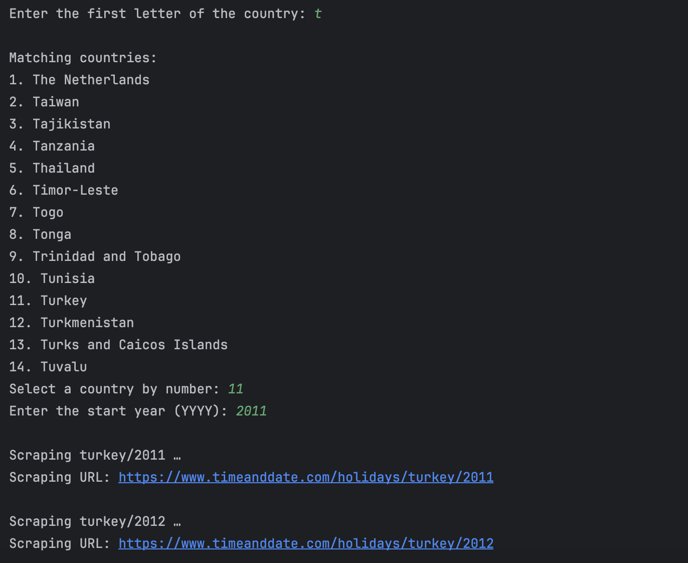

# Public Holiday Scraper

Scrapes verified national public holidays from [timeanddate.com](https://www.timeanddate.com), from a specified start year up to the current year, and saves the results into structured CSV files containing holiday names and formatted dates.

## Features

- Scrapes **verified national holidays** only (excludes observances or unofficial dates)
- Supports **all countries** listed on timeanddate.com
- Saves output as a clean, structured **CSV**
- Uses `dd/mm/yyyy` date format
- Automatically names the output file based on country and year range

## Example Usage



## Requirements

Install the required packages:

```bash
pip install -r requirements.txt

